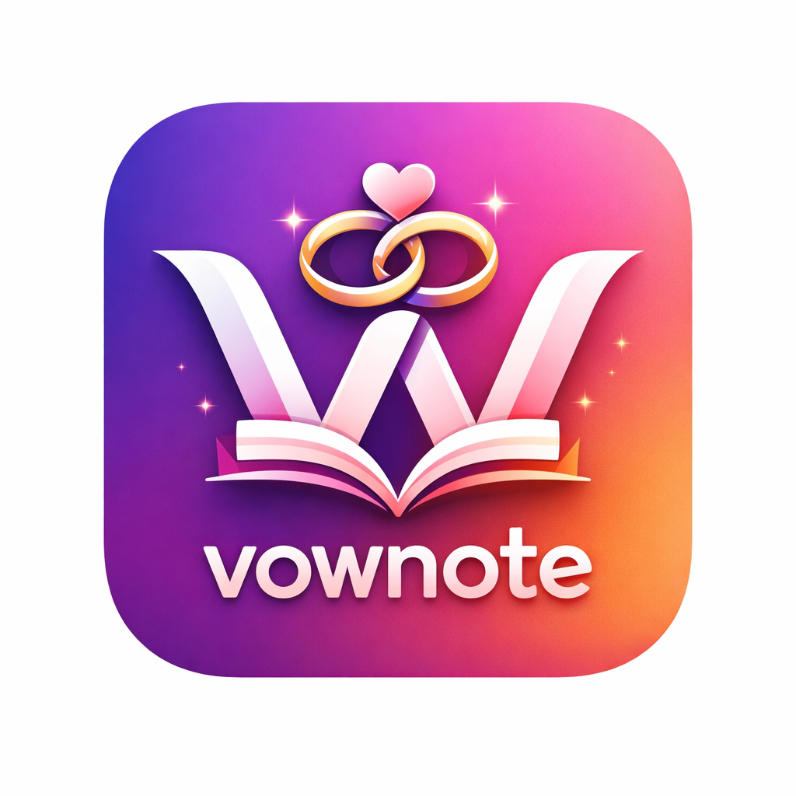

<div align="center">
  
  <h1>BizLedger</h1>
  <h3>The Ultimate Business & Event Management Solution</h3>
  <p>
    <b>Secure. Scalable. Smart.</b>
  </p>
  <p>
    <a href="https://flutter.dev"></a>
    <a href="https://dart.dev"></a>
    <a href="#"></a>
    <a href="#"></a>
  </p>
  <br>
</div>

---

## 📖 Overview

**BizLedger (v2.3.0)** is an enterprise-grade mobile application designed for event planners, caterers, and small businesses to streamline their operations. It replaces traditional paper ledgers with a secure, digital powerhouse that manages bookings, tracks complex payment schedules, and generates automated financial reports.

Built with **Flutter**, it leverages the **Material You** design system to adapt visually to the user's device, while ensuring data privacy through military-grade biometric authentication.

---

## 🏛️ Technical Architecture

BizLedger employs a **Service-Oriented Architecture (SOA)** with a strict separation of concerns, ensuring that business logic, data persistence, and UI presentation are decoupled for maximum scalability and testability.

### � Application Layers

| Layer | Responsibility | Key Components |
| :--- | :--- | :--- |
| **Presentation (UI)** | Rendering views, Animations, User Input | `HomeScreen`, `SettingsScreen`, `LockScreen` |
| **Service (Logic)** | Business validation, calculations, caching | `BiometricService`, `ThemeService`, `PdfService` |
| **Domain (Models)** | Immutable data structures, JSON serialization | `Booking`, `Payment`, `BusinessConfig` |
| **Data (Persistence)** | CRUD operations, Backup, Local Storage | `DatabaseService` (SQLite), `SharedPreferences` |

---

## 💾 Data Persistence & Storage

BizLedger uses a hybrid storage approach to balance performance and reliability.

### 1. Relational Database (SQLite)
The core business data (Bookings, Payments, Clients) is stored in a structured **SQLite** database (`vownote.db`). This ensures ACID compliance and efficient querying for complex reports.

**Table Schema: `bookings`**
```sql
CREATE TABLE bookings (
  id TEXT PRIMARY KEY,          -- Unique UUID
  customerName TEXT,            -- Client Name
  eventDates TEXT,              -- JSON Array of ISO-8601 Dates
  totalAmount REAL,             -- Financials (Double)
  totalAdvance REAL,            -- Financials (Double)
  payments TEXT,                -- JSON Array of Payment Transactions
  businessType TEXT,            -- 'catering', 'wedding', etc.
  createdAt TEXT,               -- ISO-8601 Timestamp
  updatedAt TEXT                -- ISO-8601 Timestamp
  ...
);
```

### 2. JSON Serialization Format
Complex objects like `Payment` lists and `EventDates` are serialized into JSON strings before being stored in SQLite. This "NoSQL-like" flexibility allows for evolving data requirements without constant schema migrations.

**Example `Booking` JSON Structure:**
```json
{
  "id": "550e8400-e29b-41d4-a716-446655440000",
  "customerName": "John Doe",
  "businessType": "catering",
  "totalAmount": 5000.00,
  "advanceReceived": 1500.00,
  "eventDates": [
    "2024-12-10T00:00:00.000",
    "2024-12-11T00:00:00.000"
  ],
  "payments": [
    {
      "id": "payment_1",
      "amount": 1000.00,
      "date": "2024-10-01T14:30:00.000",
      "method": "UPI"
    },
    {
      "id": "payment_2",
      "amount": 500.00,
      "date": "2024-10-05T09:15:00.000",
      "method": "CASH"
    }
  ],
  "createdAt": "2024-09-30T10:00:00.000"
}
```

---

## 🌳 Project Structure (Tree Diagram)

A clean, modular directory structure ensures maintainability.

```bash
lib/
├── models/                    # Data Definitions
│   ├── booking.dart           # Core Entity (JSON Serialization)
│   ├── business_type.dart     # Configuration Models
│   └── payment.dart           # Transaction Models
├── services/                  # Business Logic Layer
│   ├── biometric_service.dart # Handles Fingerprint/FaceID Security
│   ├── database_service.dart  # SQLite CRUD Operations
│   ├── pdf_service.dart       # Generates Invoices & Reports
│   └── theme_service.dart     # Dynamic Material You Engine
├── ui/                        # Presentation Layer
│   ├── auth_gate.dart         # Security Wrapper (App Logic)
│   ├── home_screen.dart       # Dashboard & KPIs
│   ├── lock_screen.dart       # "Beautiful UI" Biometric Prompt
│   ├── settings_screen.dart   # App Configuration
│   └── widgets/               # Reusable Components
│       ├── shimmer_text.dart  # Premium Visual Effects
│       └── performance_overlay.dart
└── utils/                     # Helpers
    ├── haptics.dart           # Custom Vibration Engine
    └── pdf_generator.dart     # Report Formatting Logic
```

---

## 🔒 Security & Privacy

### Biometric App Lock
BizLedger integrates deeply with the Android hardware security module via `FlutterFragmentActivity`.
-   **Method**: Uses `local_auth` for Fingerprint, Face Unlock, and Iris scanning.
-   **Session Management**: Authentication state is stored in **RAM (In-Memory)** only.
    -   *Cold Start*: App kill/restart clears RAM -> **Immediate Lock**.
    -   *Background*: App switching keeps RAM -> **5-Minute Grace Period**.
-   **Security**: No sensitive biometric data ever leaves the device using the hardware-backed secure enclave.

---

## � Performance Metrics

-   **Startup Time**: < 1.0 seconds (Lazy Service Loading).
-   **Rendering**: Consistent 60fps animations (using `RepaintBoundary` optimizations).
-   **Asset Size**: 98% reduction in font file sizes via aggressive tree-shaking.
-   **Memory Usage**: Optimized image caching and weak references for large lists.

---

## 📦 Installation

1.  **Clone the Repository**
    ```bash
    git clone https://github.com/kiran-embedded/-vownote-app.git
    ```
2.  **Dependencies**
    ```bash
    flutter pub get
    ```
3.  **Run (Release Mode)**
    ```bash
    flutter run --release
    ```

---

*© 2026 Developed by Kiran. All Rights Reserved.*
