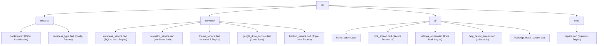

<div align="center">
  
  
  <p>
    <a href="https://flutter.dev"></a>
    <a href="https://dart.dev"></a>
    <a href="#"></a>
    <a href="#"></a>
    <a href="#"></a>
  </p>

  <h3>⚜️ BizLedger v2.3.4 — "Sensory Polish"</h3>
  <p><em>Back Press Exit Warning · Animated Navigation · Forced Dark Mode · Warning Bottom Sheets · Multi-Select Delete · Compact Valuation Layouts · Dynamic Greetings</em></p>
</div>

---

## 📱 App Screenshots

<div align="center">

<table>
  <tr>
    <td align="center" width="33%">
      
      <br/>
      <sub><b>🏠 Home · Booking List</b></sub>
    </td>
    <td align="center" width="33%">
      
      <br/>
      <sub><b>📊 Business Insights</b></sub>
    </td>
    <td align="center" width="33%">
      
      <br/>
      <sub><b>⚙️ Settings · Security & Updates</b></sub>
    </td>
  </tr>
</table>

</div>

---

# 🆚 What's New: v2.3.4 vs v2.3.2

| Feature | v2.3.2 | v2.3.4 |
| :--- | :--- | :--- |
| **Accidental Exit Protection** | ❌ None (App closes instantly on back) | ✅ Premium Exit Warning Dialog with PopScope |
| **Bottom Navigation Bar** | Standard material bottom nav | ✅ Custom animated nav with scale-fade icon effects & glow |
| **Theme System** | Toggle for Light & Dark mode | ✅ Forced Dark Mode only (cleaner, custom styling) |
| **Payment Collection (Swipe Left)**| Directly zeroes out amount on swipe | ✅ High-fidelity Confirmation Bottom Sheet with haptics & warnings |
| **Multi-Select Bulk Delete** | Mark only (Delete button hidden) | ✅ Bottom Action Bar slides up on long-press to execute deletes |
| **Valuation Display** | Long digit strings (e.g. ₹365,000) | ✅ Compact notations (e.g. ₹365K) to fit small screens |
| **Dynamic Greetings** | Hardcoded "Kiran" on dashboard | ✅ Dynamically shows Google account name, fallback to "Guest" |
| **Help Centre** | Standard expandable cards | ✅ Redesigned dark layout with collapsible emoji sections & quick filters |

---

# 🌟 Key Features in v2.3.4

### 🚪 1. Accidental Close Prevention
BizLedger now intercepts system back button gestures. If you press back on the main dashboard, you'll be greeted with a confirmation dialog:
- If in **Selection Mode**, pressing back exits selection mode.
- If on another tab (Calendar/Reports/Settings), back press navigates to the Home dashboard tab.
- If on the Home tab, a custom warning popup asks if you want to exit the app.

### 🎨 2. Custom Animated Navigation Bar
Replaced the default Flutter navigation bar with a custom high-fidelity widget:
- Smooth scale-up and scale-down animations when selecting items.
- Elegant active background glow and text styling transition.
- Tactile feedback synced with screen changes.

### 🖤 3. Unified Pure Dark Mode
We removed light mode toggles and forced the system into pure AMOLED-friendly dark mode:
- Minimizes battery drain and increases contrast.
- Gold accents (`#D4AF37`) pop beautifully across the dark interface.

### 💸 4. Swipe to Receive (With Confirmation Warning)
No more accidental payment receipts. Swiping left (←) on a pending payment card now opens a confirmation sheet:
- Displays target client name and pending balance.
- Features a caution note: *"This will mark the full pending amount as received. This cannot be undone easily."*
- Heavy haptic vibration fires upon clicking "Confirm".

### 🗑️ 5. Long-Press Multi-Delete Action Bar
Long-press any booking card to enter Selection Mode:
- Select multiple cards at once.
- A dedicated dark action bar slides up from the bottom showing `Cancel`, the number of items selected, and a red `Delete (N)` button.

### 📊 6. Compact Layouts
To support compact screens, large figures are formatted using standard compact numbers:
- Total Valuation cards show e.g. `₹365K` or `₹1.5M`.
- Home screen pending cards adjust to clean short codes automatically.

---

# 📂 Technical Directory Structure


```mermaid
graph TD
    A[lib/] --> B[models/]
    A --> C[services/]
    A --> D[ui/]
    A --> E[utils/]

    B --> B1["booking.dart (JSON Serialization)"]
    B --> B2["business_type.dart (Config Factory)"]

    C --> C1["database_service.dart (SQLite WAL Engine)"]
    C --> C2["biometric_service.dart (Hardware Auth)"]
    C --> C3["theme_service.dart (Material 3 Engine)"]
    C --> C4["google_drive_service.dart (Cloud Sync)"]
    C --> C5["backup_service.dart (Triple-Lock Backup)"]

    D --> D1[home_screen.dart]
    D --> D2["lock_screen.dart (Secure Enclave UI)"]
    D --> D3["settings_screen.dart (Pure Dark Layout)"]
    D --> D4["help_center_screen.dart (collapsible)"]
    D --> D5["bookings_detail_screen.dart"]

    E --> E1["haptics.dart (Premium Engine)"]
```

---

# 📦 Installation & Deployment

### Prerequisites
- Flutter SDK: `3.27.0+`
- Dart SDK: `3.0.0+`
- Java: `JDK 17`

### Build Instructions

1. **Clone the Repository**
    ```bash
    git clone https://github.com/kiran-embedded/-vownote-app.git
    cd -vownote-app
    ```

2. **Fetch Dependencies**
    ```bash
    flutter pub get
    ```

3. **Install to Device**
    ```bash
    flutter build apk --release
    adb install build/app/outputs/flutter-apk/app-release.apk
    ```
