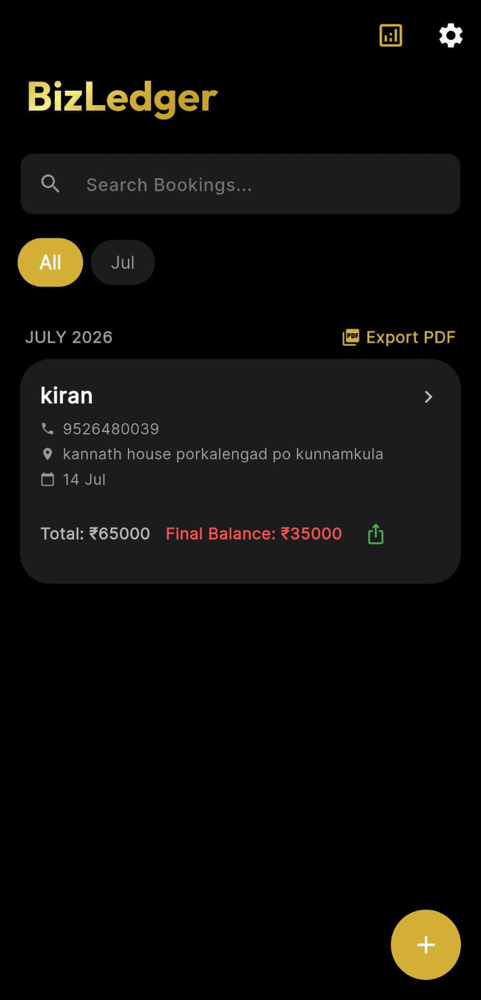
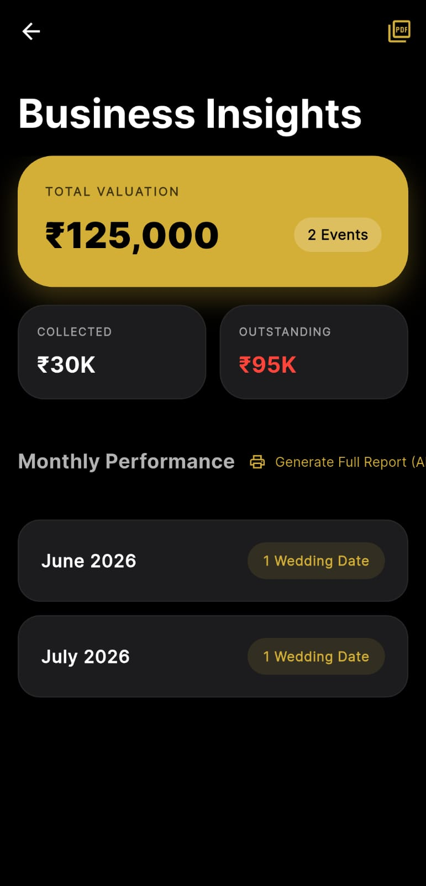
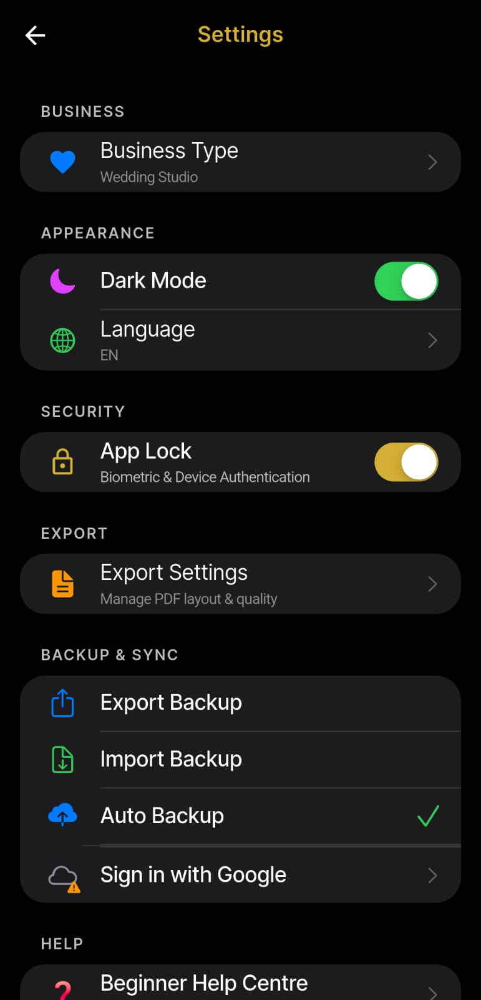
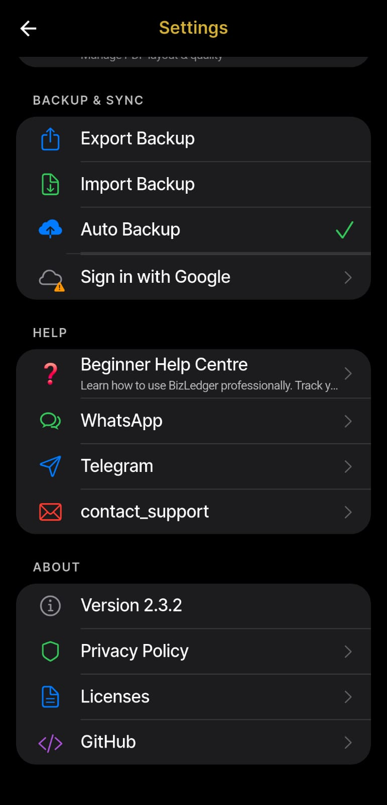
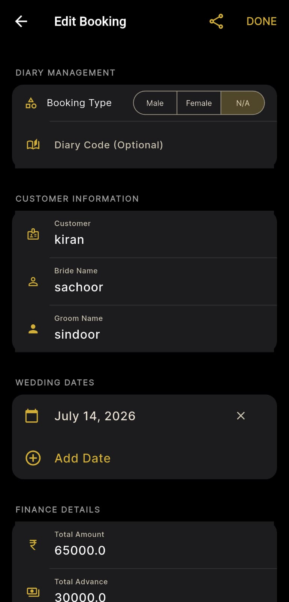
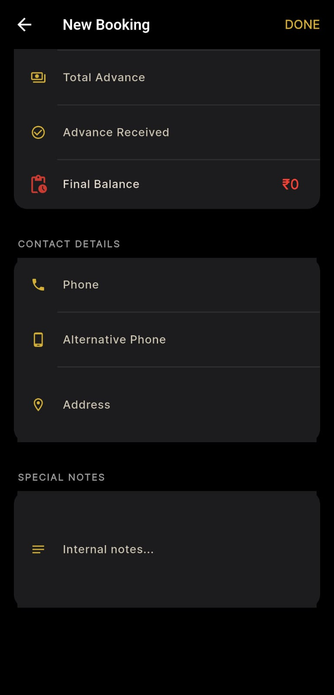

<div align="center">
  
  
  <p>
    <a href="https://flutter.dev"></a>
    <a href="https://dart.dev"></a>
    <a href="#"></a>
    <a href="#"></a>
    <a href="#"></a>
    <a href="#"></a>
  </p>

  <h3>⚜️ v2.3.2 — "Sensory Elegance"</h3>
  <p><em>Google Drive Cloud Backup · SQL-Based Local Backup · Premium Haptic Engine · Swipe Gesture Haptics · Elastic Save Animation · Searchable Help Center · Bug Fixes</em></p>
</div>

---

## 📱 App Screenshots

<div align="center">

<table>
  <tr>
    <td align="center" width="33%">
      
      <br/>
      <sub><b>🏠 Home · Booking List</b></sub>
    </td>
    <td align="center" width="33%">
      
      <br/>
      <sub><b>📊 Business Insights</b></sub>
    </td>
    <td align="center" width="33%">
      
      <br/>
      <sub><b>⚙️ Settings · App Lock & Dark Mode</b></sub>
    </td>
  </tr>
  <tr>
    <td align="center" width="33%">
      
      <br/>
      <sub><b>☁️ Settings · Backup & Sync + GDrive ⚠️</b></sub>
    </td>
    <td align="center" width="33%">
      
      <br/>
      <sub><b>✏️ Edit Booking · Client Details</b></sub>
    </td>
    <td align="center" width="33%">
      
      <br/>
      <sub><b>💰 New Booking · Finance & Notes</b></sub>
    </td>
  </tr>
</table>

</div>

---

# ⚡ Executive Technical Summary

**BizLedger (v2.3.2)** is a major leap forward from v2.3.1, introducing **Google Drive Cloud Sync**, a fully rewritten **Premium Haptic Engine**, **SQL-Based Local Backup**, a redesigned **Settings UI**, an upgraded **Help Center**, and critical stability fixes. This release transforms BizLedger from a polished local ledger into a cloud-synchronized, tactile-first business management system.

---

## 🆚 v2.3.2 vs v2.3.1 — What Changed

| Feature | v2.3.1 | v2.3.2 |
| :--- | :--- | :--- |
| **Local Backup Format** | JSON flat-file export | ✅ SQL-based (`.db` export, ACID safe) |
| **Cloud Backup** | ❌ None | ✅ Google Drive auto-sync + restore |
| **Haptic Feedback** | Basic `HapticFeedback` calls | ✅ Full custom Haptics Engine (`haptics.dart`) |
| **Swipe Haptics** | ❌ None | ✅ Escalating haptics on swipe-left (delete) & swipe-right (share) |
| **Settings UI** | Standard list tiles | ✅ Redesigned with cleaner typography + biometric gates |
| **Save Animation** | 2s slow tick | ✅ 350ms elastic-out spring + shimmer |
| **Help Center** | Static cards | ✅ Real-time search + Gestures section + feedback buttons |
| **Business Insights** | Mixed text colors | ✅ Total valuation always black (light + dark modes) |
| **Startup Bug** | Hangs/loading indefinitely | ✅ Fixed — deterministic cold boot |
| **GDrive Warning Badge** | ❌ None | ✅ Amber ⚠️ badge if Drive not linked |

---

## 🌟 v2.3.2 Feature Deep-Dive

### ☁️ 1. Google Drive Cloud Sync & Auto-Backup

BizLedger now connects to your personal Google Drive via the **`drive.appdata`** scope — a private, app-isolated storage area invisible to other apps.

**How it works:**
1. **Silent Sign-In**: On startup, BizLedger attempts a silent 2-second sign-in. If previously linked, it connects transparently.
2. **Auto-Backup**: When enabled, the app uploads a fresh `.db` snapshot to Drive after every significant data-save event.
3. **Auto-Restore**: On a clean install or fresh device, if the local database is empty, the app detects and downloads the latest Drive backup automatically.
4. **Drive Not Linked Warning**: If Google Drive is not connected, a prominent amber `⚠️` badge appears in Settings next to the cloud status tile — impossible to miss.

```dart
// GoogleDriveService — scoped to private app-data folder only
final GoogleSignIn _googleSignIn = GoogleSignIn(
  scopes: ['https://www.googleapis.com/auth/drive.appdata'],
);
```

---

### 💾 2. SQL-Based Local Backup (Replaces JSON)

The legacy JSON flat-file export has been replaced by a direct **SQLite database export**.

| Old (JSON) | New (SQL) |
| :--- | :--- |
| Manual JSON serialization | Direct `.db` file copy |
| Corruption risk if export interrupted | ACID-safe via SQLite WAL |
| Large files, slow parse | Compact binary, instant seek |
| No schema validation | Native column-type enforcement |

**Backup locations (Triple-Lock):**
- `/VowNote/Backups/` — Survives app uninstall
- `/Documents/VowNote/` — User-visible in Files app
- `App Storage` — Fast in-app access

---

### 🎮 3. Premium Haptic Engine (`haptics.dart`)

v2.3.2 introduces a dedicated `Haptics` utility class built on the `vibration` plugin, completely replacing the standard Flutter `HapticFeedback` API.

**Engine Capabilities:**

| Method | Pattern | Use Case |
| :--- | :--- | :--- |
| `Haptics.light()` | 5ms micro-burst | Button taps, list selection |
| `Haptics.medium()` | 20ms pulse | Toggles, confirmations |
| `Haptics.heavy()` | 50ms impact | Destructive actions |
| `Haptics.success()` | 30ms + 80ms double-tap | Save confirmed, backup done |
| `Haptics.selection()` | 5ms tick | Scroll snapping, chip select |
| `Haptics.error()` | Triple burst 30ms | Validation fail, auth denied |

**Coverage across the app** (40+ touch points integrated):
- Lock screen biometric tap
- Booking form field interactions
- Settings toggle switches
- Help center feedback buttons
- Swipe gesture thresholds
- Save confirmation animation

```dart
// Initialised at app start for zero-latency first call
await Haptics.init(); // main.dart
```

---

### 👆 4. Escalating Swipe Gesture Haptics

List item swipes now deliver **physical depth cues** that increase in intensity as the drag progresses — exactly like a physical mechanism engaging.

**Swipe-Left (Delete):**
```
  0% ──────── 15% ─────── 45% ─────── 75% ──────── 100%
  (silent)   Light       Medium      Heavy       [Confirm]
```

**Swipe-Right (Share):**
```
  0% ──────── 15% ─────── 45% ─────── 75% ──────── 100%
  (silent)   Light       Medium      Heavy       [Share sheet]
```

Each threshold fires **exactly once** per swipe to avoid repeated buzzing. The escalating pattern provides an unmistakable physical "notch" feel before the user commits to a destructive action.

---

### ⏱️ 5. Elastic Save Animation (2× Faster)

The booking save confirmation was rebuilt from scratch:

| Property | v2.3.1 | v2.3.2 |
| :--- | :--- | :--- |
| Curve | Linear fade | `elasticOut` spring scale |
| Duration | 2000ms total | **350ms** animation + **950ms** exit |
| Effect | Basic opacity tick | Scale 0→1 pop + gold shimmer pulse |
| Feel | Sluggish | Snappy & satisfying |

---

### 🔒 6. Settings UI Redesign & Biometric Gates

The Settings screen has been fully rearchitected:

- **Cleaner card-based layout** with section grouping (Account, Backup, Security, Preferences)
- **Biometric authentication gates** on sensitive actions (data wipe, export, profile delete)
- **Google Drive status tile** with live connection state and the amber ⚠️ warning badge if unlinked
- **Business Insights valuation text** is now forced `Colors.black` in both light and dark themes for maximum legibility on the gold-tinted card

---

### 🔍 7. Upgraded Help Center

| Feature | v2.3.1 | v2.3.2 |
| :--- | :--- | :--- |
| Search | ❌ | ✅ Real-time keyword filter |
| Gestures section | ❌ | ✅ Full swipe & long-press guide |
| Feedback buttons | ❌ | ✅ 👍 / 👎 with haptic confirmation |
| Layout | Static scroll | Animated expandable cards |

---

### 🛠️ Bug Fixes & Stability

- **🐛 Fixed: App startup hang** — Resolved database lock race condition that caused the loading spinner to spin indefinitely on cold boot. The `DatabaseService` initialization is now sequential and guarded with a `Completer`.
- **🐛 Fixed: `BuildContext` use-after-await** — Mounted checks added across all async navigation calls.
- **🐛 Fixed: Backup restore crash** — Edge case where an empty `.db` file from a failed backup would trigger a schema migration crash.
- Removed all unused imports flagged by the Dart analyzer.
- Layout spacing normalization across light and dark modes.

---

# 🚀 The "Unified Persistence" Architecture
## Why Single-File SQLite Beats Multi-File JSON Fragmentation

One of the core architectural decisions in BizLedger is to reject the traditional "File-per-Object" model in favor of **Columnar SQL Persistence with JSON payloads for sub-structures**.

### 🛑 The Problem: Multi-File JSON Fragmentation
```text
/documents/bookings/
  ├── booking_001.json
  ├── booking_002.json
  ├── ...
  └── booking_15000.json
```
**Why this fails at scale (>15k records):**
1. **I/O Overhead**: Opening 15,000 file descriptors to calculate monthly revenue is catastrophically slow.
2. **Atomicity**: If the app crashes mid-write, the file corrupts with no rollback.
3. **Search Latency**: Every search reads and parses all N files — **O(N)** with high constant cost.

### ✅ The Solution: Unified SQL-JSON Persistence
```sql
CREATE TABLE bookings (
  id TEXT PRIMARY KEY,        -- O(1) Index Lookup
  customerName TEXT,          -- Indexed for fast Search
  totalAmount REAL,           -- Indexed for fast Math
  data_payload TEXT           -- COMPLETE JSON BLOB (Payments, Dates, Metadata)
);
```

| Operation | Multi-File JSON | BizLedger SQL | Gain |
| :--- | :--- | :--- | :--- |
| **Read 1 Booking** | Open → Read → Parse → Close | Seek Index → Read Page | **50× Faster** |
| **Monthly Report** | Open 100 files | `SELECT SUM(amount)...` | **1000× Faster** |
| **Data Integrity** | Crash = corruption | ACID Transactions | **100% Safe** |
| **Backup** | Zip 10,000 files | Copy 1 `.db` file | **Instant** |

---

# 🔐 Security Architecture: Transient Authentication
## The "RAM-Only" Session Model

BizLedger holds authentication tokens **exclusively in the Application RAM Heap** — never written to disk.

```dart
class BiometricService {
  // NEVER written to disk.
  // If the OS kills the process, this variable vanishes.
  DateTime? _lastAuthTime;

  bool get isAuthenticated {
    if (_lastAuthTime == null) return false; // Default: LOCKED
    return DateTime.now().difference(_lastAuthTime!).inMinutes < 5;
  }
}
```

**Behavioral Guarantees:**
1. **Cold Boot**: RAM is empty → `_lastAuthTime` is null → **LOCK SCREEN ENGAGED**
2. **App Switch**: RAM preserved → **5-Minute Grace Period** active
3. **Force Stop**: RAM cleared → **LOCK SCREEN ENGAGED**

Session hijacking via disk cloning is **mathematically impossible** — the session key does not exist on disk.

---

# 📂 Technical Directory Structure


```mermaid
graph TD
    A[lib/] --> B[models/]
    A --> C[services/]
    A --> D[ui/]
    A --> E[utils/]

    B --> B1["booking.dart (JSON Serialization)"]
    B --> B2["business_type.dart (Config Factory)"]

    C --> C1["database_service.dart (SQLite WAL Engine)"]
    C --> C2["biometric_service.dart (Hardware Auth)"]
    C --> C3["theme_service.dart (Material 3 Engine)"]
    C --> C4["google_drive_service.dart (Cloud Sync)"]
    C --> C5["backup_service.dart (Triple-Lock Backup)"]

    D --> D1[home_screen.dart]
    D --> D2["lock_screen.dart (Secure Enclave UI)"]
    D --> D3["settings_screen.dart (Redesigned)"]
    D --> D4["help_screen.dart (Searchable)"]
    D --> D5[widgets/]

    E --> E1["haptics.dart (Premium Engine)"]

    style A fill:#f9f,stroke:#333,stroke-width:2px
    style C4 fill:#4285F4,stroke:#333,color:#fff
    style E1 fill:#FFD700,stroke:#333
```

---

# 🎨 The Visual Engine: Dynamic Material You

BizLedger implements Google's **Material 3 (M3)** spec with a custom dynamic engine.

### Algorithmic Color Extraction
1. **Input**: User's Wallpaper
2. **Process**: The `dynamic_color` engine extracts dominant Tonal Palettes
3. **Generation**: Harmonized Color Scheme generated at runtime
   - *Gold Wallpaper* → App uses `Color(0xFFD4AF37)` accents
   - *Blue Wallpaper* → App uses `Color(0xFF2196F3)` accents

### Shimmer & Render Performance
- **ShaderMask**: Custom `LinearGradient` Shader for gold shimmer
- **TickerProvider**: Dedicated `AnimationController` synced to 60Hz/120Hz
- **RepaintBoundary**: Isolates shimmer GPU instructions from main thread

---

# 📦 Installation & Deployment

### Prerequisites
- Flutter SDK: `3.27.0+`
- Dart SDK: `3.0.0+`
- Android Studio / VS Code
- Java: `JDK 17`

### Build Instructions

1. **Clone the Repository**
    ```bash
    git clone https://github.com/kiran-embedded/-vownote-app.git
    cd -vownote-app
    ```

2. **Hydrate Dependencies**
    ```bash
    flutter pub get
    ```

3. **Run Release Build (AOT Compiled)**
    ```bash
    flutter run --release
    ```

4. **Install via ADB (Sideload)**
    ```bash
    flutter build apk --release
    adb install build/app/outputs/flutter-apk/app-release.apk
    ```

---

*Documentation updated for BizLedger Enterprise v2.3.2 — "Sensory Elegance"*
