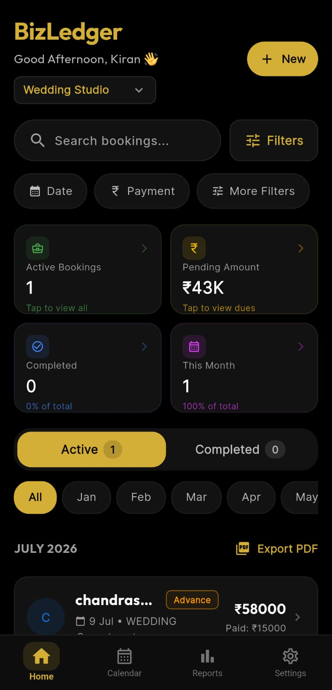
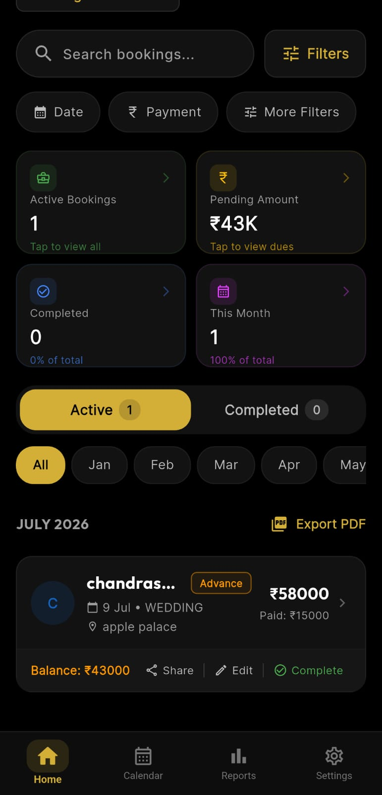
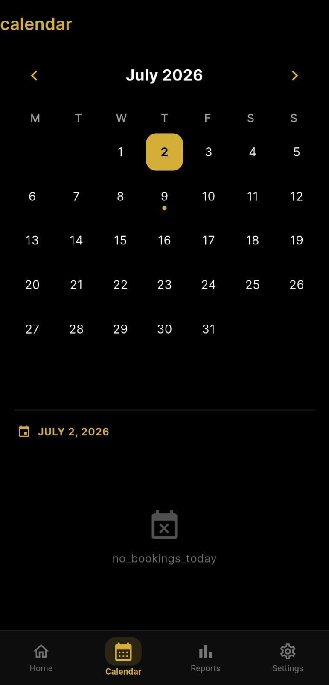
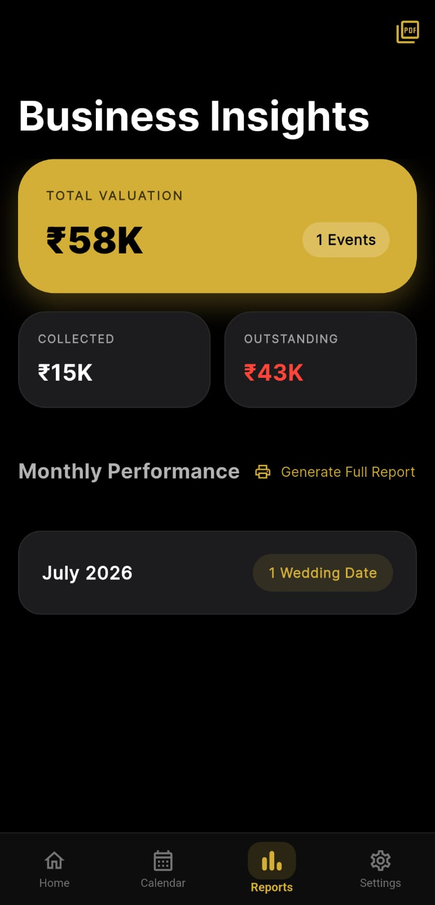
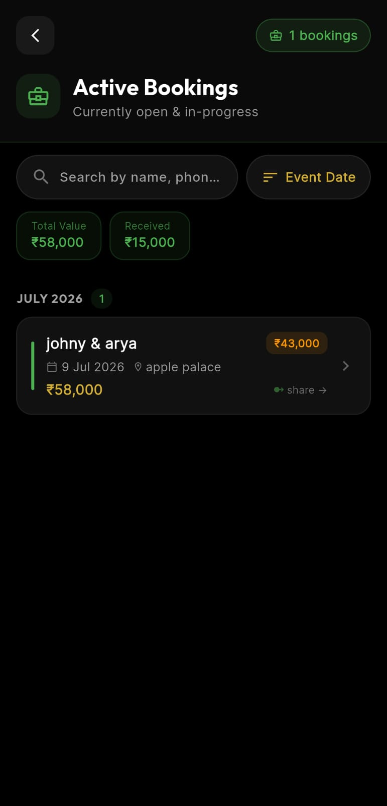
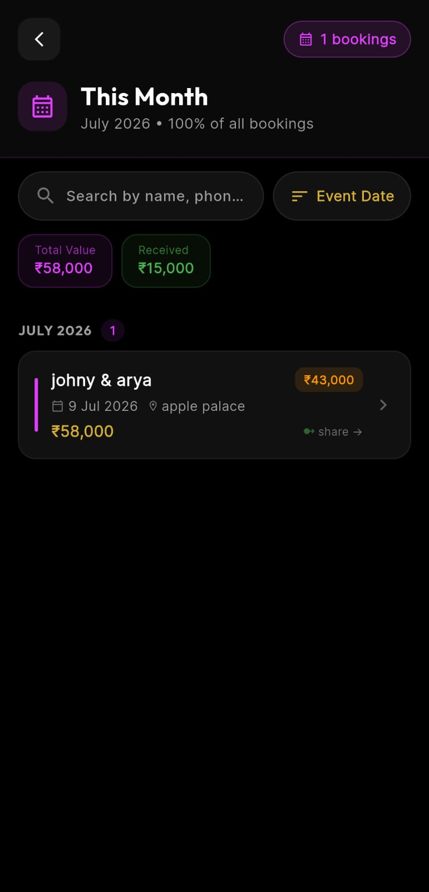
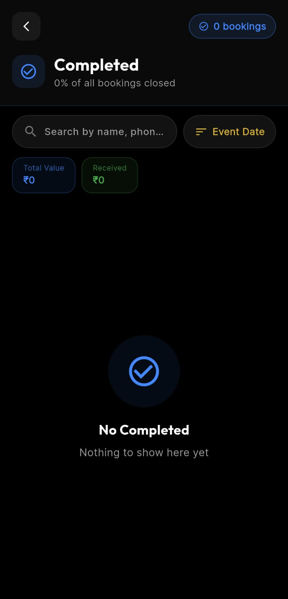
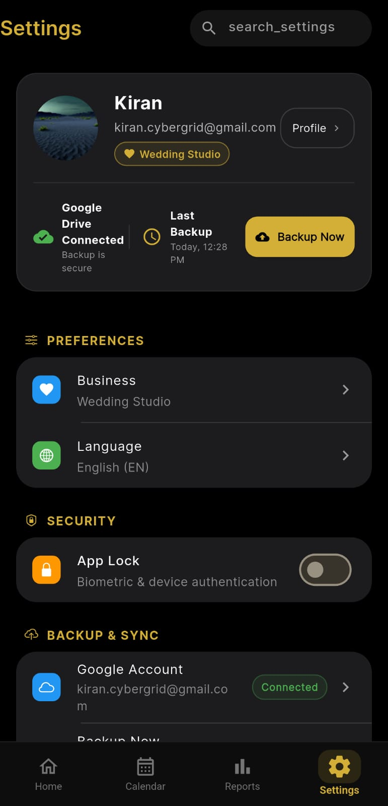
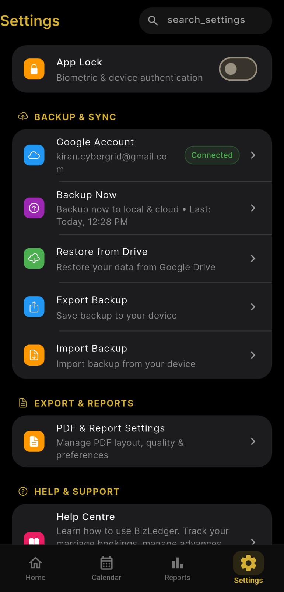
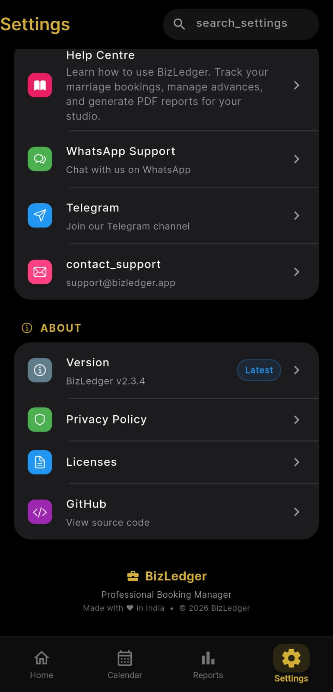

# BizLedger (v2.3.4)

BizLedger is a high-performance business registry application designed for local persistence, offline independence, and sensory elegance.

---

## 🆚 Layout Evolution: Old vs New UI

Below is a direct comparison showing the design evolution from the legacy dashboard to the new stateful design:

<div align="center">
<table>
  <tr>
    <td align="center" width="50%">
      
      <br/>
      <sub><b>❌ Legacy UI (v2.3.2)</b><br/>Navigation driven by top icons inside SliverAppBar; float button layout.</sub>
    </td>
    <td align="center" width="50%">
      
      <br/>
      <sub><b>✅ New UI (v2.3.4)</b><br/>Custom stateful Bottom Navigation Bar; top filter pills; dynamic name greetings.</sub>
    </td>
  </tr>
</table>
</div>

---

## 📱 App Screenshot Gallery

<div align="center">

### Core Screens & Viewports
<table>
  <tr>
    <td align="center" width="25%">
      
      <br/><sub><b>🏠 Home Dashboard</b></sub>
    </td>
    <td align="center" width="25%">
      
      <br/><sub><b>🔍 Expanded Card Quick Actions</b></sub>
    </td>
    <td align="center" width="25%">
      
      <br/><sub><b>📅 Events Calendar</b></sub>
    </td>
    <td align="center" width="25%">
      
      <br/><sub><b>📊 Financial Reports</b></sub>
    </td>
  </tr>
</table>

### Dynamic Pre-Filtered Feeds (Detail Screen)
<table>
  <tr>
    <td align="center" width="25%">
      
      <br/><sub><b>🟢 Active Bookings</b></sub>
    </td>
    <td align="center" width="25%">
      
      <br/><sub><b>🟡 Pending Dues</b></sub>
    </td>
    <td align="center" width="25%">
      
      <br/><sub><b>📅 This Month</b></sub>
    </td>
    <td align="center" width="25%">
      
      <br/><sub><b>🔵 Completed (Empty State)</b></sub>
    </td>
  </tr>
</table>

### System Settings Layout
<table>
  <tr>
    <td align="center" width="33%">
      
      <br/><sub><b>⚙️ Profile & Preferences</b></sub>
    </td>
    <td align="center" width="33%">
      
      <br/><sub><b>☁️ Backup & Sync</b></sub>
    </td>
    <td align="center" width="33%">
      
      <br/><sub><b>ℹ️ About & Version</b></sub>
    </td>
  </tr>
</table>

</div>

---

## 🏗️ Technical Architecture & Persistence Model

### 1. Unified SQLite Engine (SQL-JSON Hybrid)
* **Encrypted Storage**: Relies on `sqflite_sqlcipher` to implement hardware-accelerated local data encryption using an 256-bit AES cryptographic passkey.
* **ACID Transactions & WAL mode**: Configured with Write-Ahead Logging (`PRAGMA journal_mode = WAL;`) and relaxed synchronization (`PRAGMA synchronous = NORMAL;`) to ensure high-performance concurrent writes and reads without risking data corruption during interruptions.
* **Triple-Lock Local Backups**: The `BackupService` triggers a database copy to three distinct locations:
  1. Internal App Sandbox
  2. Public `/Documents/BizLedger/` folder for user accessibility
  3. External Shared Storage `/BizLedger/Backups/` to survive app uninstallation
* **WAL Checkpointing**: Before replication, the backup engine issues `PRAGMA wal_checkpoint(FULL);` to flush all transactional changes from the WAL log directly into the primary binary `.db` file, guaranteeing backup integrity.
* **Google Drive Integration**: Auto-synchronizes the encrypted database snapshot directly to the user's Google Drive appdata folder, keeping the user's data isolated and private.

---

## 🎨 User Interface & Navigation Evolution

The application navigation has been redesigned for a more seamless and intuitive experience.

```
OLD NAVIGATION MODEL (v2.3.2)
[ SliverAppBar (Top Calendar Icon + Top Settings Icon + Top Insight Icons) ]
                         │ (Taps trigger modals/pushes)
                         ▼
             [ Unified Dashboard List ]

NEW STATEFUL NAVIGATION MODEL (v2.3.4)
[ PageView (Horizontal Swipe / Navigation Controller) ]
  ├── 🏠 Home Dashboard (Stats Grid, Action Pills, Bookings Feed)
  ├── 📅 Events Calendar (Extracted Screen, Date-highlight grids)
  ├── 📊 Financial Reports (Analytics, Compact Valuation Indicators)
  └── ⚙️ System Settings (Biometrics, Cloud Sync, Version Check)
                         ▲
                         │ (Controlled by bottom viewport controller)
[ Animated Bottom Navigation Bar (Scale transitions & active glow overlays) ]
```

### 1. PageView Navigation & Bottom Bar
* **Old Structure**: Screens like the Calendar and Settings were pushed onto the navigation stack using icons pinned to the top header (`SliverAppBar` actions).
* **New Structure**: Replaced with an active `PageView` coupled with a custom, low-latency **Bottom Navigation Bar**. Selected tabs animate with custom scale transitions, active background glow boxes, and text state changes.

### 2. Multi-Pill Advanced Filters
* Tapping filter chips directly executes queries:
  * **This Month / Today / This Week**: Pre-calculates DateTime offsets to isolate bookings matching localized date lists.
  * **Payment Pills**: Segregates clients based on remaining balance calculations (`totalWithTax - advanceReceived`).
  * **Advanced Filter Engine**: Searches names, phone numbers, notes, locations, and booking IDs, and allows sorting by date, creation time, or invoice amount.

### 3. Dedicated Sub-Screens
* **`bookings_detail_screen.dart`**: Shows a pre-filtered list of bookings based on the clicked card, equipped with localized query states.
* **`calendar_screen.dart`**: Displays an interactive calendar with colored indicators showing bookings and events per day.

---

## 👆 Gestures & User Safeguards

### 1. Dual-Swipe List Operations
List items in `BookingsDetailScreen` are wrapped with a `Dismissible` widget supporting dual actions:
* **Swipe Right (→) to Share**: Fires `share_plus` to generate pre-formatted WhatsApp thank-you messages with client details.
* **Swipe Left (←) to Receive**: Triggers a confirmation bottom sheet. It presents a warning (*"This will mark the full pending amount as received. This cannot be undone easily."*), prompting verification to prevent accidental updates.

### 2. Selection Mode & Bulk Actions
* Long-pressing any card in the main dashboard activates **Selection Mode**.
* A persistent action bar slides up from the bottom showing the selection count along with `Cancel` and `Delete` actions.

### 3. Exit Protection
* Employs Flutter's `PopScope` to handle Android's system back button gestures:
  * If in Selection Mode, back press deselects items.
  * If on non-home tabs, back press returns to the Home dashboard page.
  * If on the Home page, back press prompts an exit confirmation dialog.

---

## 🛠️ Setup & Development

### Commands
```bash
# Get dependencies
flutter pub get

# Generate release APK
flutter build apk --release

# Sideload build
adb install build/app/outputs/flutter-apk/app-release.apk
```
