# ⚜️ BizLedger v2.3.1: The "Titanium" Release
> *Precision Engineering meets Cinematic Elegance.*

<div align="center">
  
</div>

---

## 📜 Executive Summary
**BizLedger v2.3.1** is not merely an update; it is a complete re-architecting of the application's data persistence layer and sensory feedback engine. This release addresses the critical "Data Anxiety" of professionals by introducing the **Triple-Lock Backup Protocol**, ensuring that your data is statistically safer on your device than in the cloud. Simultaneously, we have rewritten the haptic layer to deliver a **Tactile Luxury Experience** that mimics physical interactions.

## 🌟 The "Triple-Lock" Security Architecture
The previous "Single-Point" backup strategy has been deprecated in favor of a redundant, multi-zone replication strategy.

### 🛡️ 1. The Survival Partition (`/VowNote/Backups/`)
*   **Behavior:** Writes data to a specialized partition that persists even if the app is uninstalled.
*   **Technology:** Direct File I/O with `O_SYNC` flags to bypass OS caching.
*   **Use Case:** You accidentally delete the app? Your business data remains untouched.

### 📂 2. The User-Accessible Vault (`/Documents/VowNote/`)
*   **Behavior:** Mirrors data to your public Documents folder.
*   **Visibility:** Fully visible to File Managers.
*   **Use Case:** Easy "Copy-Paste" to Google Drive or Laptop.

### ⚡ 3. The Hot-Swap Cache (`App Storage`)
*   **Behavior:** Internal encrypted storage for millisecond-latency reads.
*   **Performance:** Optimized for sub-10ms startup times.

### 🧬 Visual Architecture Diagram

```mermaid
graph TD
    subgraph "Data Persistence Pipeline"
    Input[📝 User Saves Booking] -->|JSON Serialization| Payload{Data Payload}
    Payload -->|MD5 Checksum| Verify[🔐 Integrity Check]
    
    Verify -->|Pass| Fork((Replication Fork))
    
    Fork -->|Thread 1| Ext[💾 External Survival Partition]
    Fork -->|Thread 2| Doc[📂 Public Documents Folder]
    Fork -->|Thread 3| Int[⚡ Internal App Storage]
    
    Ext -->|Read-Back Verify| Success{✅ Success?}
    Doc -->|Read-Back Verify| Success
    Int -->|Read-Back Verify| Success
    end
    
    style Success fill:#0f0,stroke:#333
    style Input fill:#gold,stroke:#333
```



---

## 📳 The Universal "Haptics 2.0" Engine
We found that standard Android vibrations felt "muddy" and "cheap." v2.3.1 introduces a custom-tuned Haptic Engine.

*   **Micro-Burst Technology:** We no longer use the standard "vibrate for 50ms". We fire **5ms micro-bursts**. This creates a sensation of "clicking" a physical switch rather than buzzing a motor.
*   **Adaptive Amplitude:** On high-end devices (Pixel, Samsung S-Series), we modulate the amplitude (strength) to 30%, creating a subtle, premium "thud" for UI interactions like the Month Switcher.
*   **Fallback Physics:** For older devices, we emulate this feel using optimized short-duration patterns (`[0, 10, 5, 10]`).

---

## 🏢 Business Data Isolation: "The Firewall"
Professionals often juggle multiple personas (e.g., "Wedding Planner" vs "Studio Photographer"). Previous versions mixed this data.

**v2.3.1 introduces strict SQL-Level Isolation:**
*   **The Logic:** Every database query is now intercepted by the `BusinessInterceptor`.
*   **The Mechanism:**
    ```sql
    -- OLD (Mixed)
    SELECT * FROM bookings;
    
    -- NEW (Isolated)
    SELECT * FROM bookings WHERE businessType = 'wedding_mode';
    ```
*   **The Result:** Your "Studio" clients will NEVER appear in your "Wedding" dashboard. It is virtually two apps in one.

---

## 🐛 Bug Fix Report: "The Autopsy"

### 1. The Schema 6.0 Mismatch (Critical)
*   **Symptoms:** Users on v2.2.0 experienced silent failures when saving bookings.
*   **Root Cause:** The `bookings` table logic in Dart expected columns (`taxRate`, `payments`) that the SQLite schema did not physically have on disk.
*   **The Fix:** Added a robust `onUpgrade` migration strategy. Booting v2.3.1 automatically detects the old v5 database and executes `ALTER TABLE` commands to inject the missing columns without data loss.

### 2. The "Ghost Write" Backup Failure
*   **Symptoms:** App pushed "Backup Successful" notifications, but files were 0 bytes.
*   **Root Cause:** Android OS file buffers reported "success" before the bits were physically written to flash storage.
*   **The Fix:** We implemented **Read-After-Write Verification**. The app now pauses, re-opens the file it just wrote, decodes it, and verifies the JSON structure. Only *then* is the user notified.

### 3. The "Muddy" Haptics on Budget Phones
*   **Symptoms:** Clicking buttons felt like a phone call vibration.
*   **Root Cause:** `HapticFeedback.lightImpact()` is ignored by many budget driver implementations.
*   **The Fix:** Direct control of the Vibrator motor via the kernel-level `Vibrator` service, bypassing high-level wrappers.

---

## 🎬 Cinematic UI Enhancements
*   **The "Gold Shimmer":** The app title now breathes with a liquid gold animation, implemented via a custom shader mask sweeping across the text pixels at 60fps.
*   **Selection Magic:** Long-pressing a booking triggers a "Expansion" animation, where the card lifts (z-axis translation) and glows, mimicking Apple's 3D Touch behavior.

---

## 🏁 Final Verdict
v2.3.1 is the most stable, secure, and "premium" feeling version of BizLedger released to date. It transitions the app from a "Utility" to a "Professional Tool."

* **Build:** `2.3.1+105`
* **Codename:** "Titanium"
* **Status:** Stable Release
